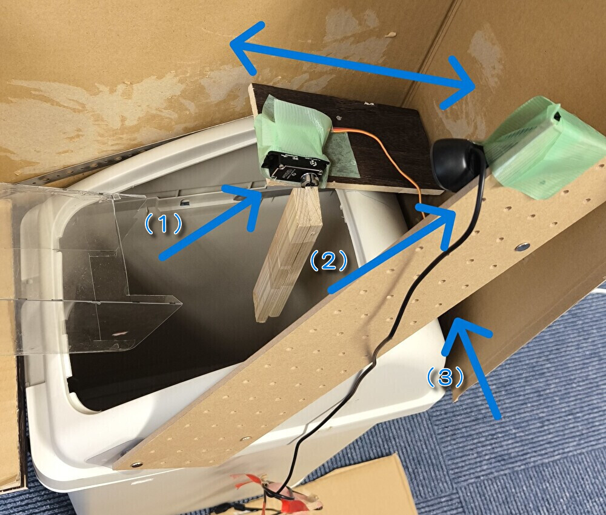
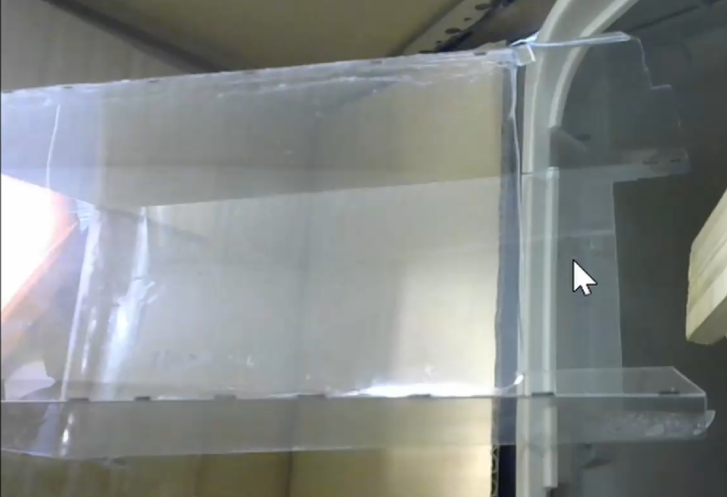

## Introduction
 We have developed **an intelligent trash bin** equipped with AI technology. This trash bin automatically identifies whether a PET bottle is recyclable or not, and removes non-recyclable items. As depicted in the gif below, it accurately detects labeled or capped PET bottles.<br>


 This machine utilizes deep learning from YOLOv5 to detect PET bottles, labels, and caps. In this project, we created an original dataset consisting of various PET bottles with labels or caps, as well as those without such decorations. Additionally, we programmed the Jetson Nano to control a servo motor, allowing the machine to remove bottles with decorations.

## Table of contents
1. [Background](#background)
1. [Requirements](#requirements)
1. [Set up](#set-up)
1. [Running the application](#running-application)
1. [How it works](#how-it-works)
1. [How the Intelligent Trash Bin Ejects PET Bottles](#how-the-intelligent-trash-bin-ejects-pet-bottles)
1. [Data collection](#data-collection)
1. [Training yolov5](#training-yolov5)
1. [Future direction](#future-directions)

## Background
In waste management facilities, collected PET bottles undergo a sorting process where labels, caps, and contaminated bottles are separated to recycle clean PET bottles. This sorting is often performed manually, which is labor-intensive. By utilizing this smart trash bin, the workload at these facilities can be significantly reduced.<br>
<div style="text-align: left;">

</div>

At the waste processing facility, plastic bottles are being sorted by hand<br>
References : [ペットボトルの分別について | 北見市](https://www.city.kitami.lg.jp/administration/life/detail.php?content=11965) 

## Requirements
* Hardware
    * Jetson nano 2GB
    * [C270n HD Web Camera](https://www.logicool.co.jp/ja-jp/products/webcams/hd-webcam-c270n.960-001265.html)
    * [FLASH HOBBY 45KG Coreless servo motor 8.4V](https://www.amazon.co.jp/dp/B09W4SZNCG/ref=sspa_dk_detail_2?pd_rd_i=B09W4SZNCG&pd_rd_w=JRDh4&content-id=amzn1.sym.f293be60-50b7-49bc-95e8-931faf86ed1e&pf_rd_p=f293be60-50b7-49bc-95e8-931faf86ed1e&pf_rd_r=1JKFW3EMHH3JNZ7M665W&pd_rd_wg=hcBMZ&pd_rd_r=7afb22f4-2fd2-4c27-ace7-4ecac3632113&s=hobby&sp_csd=d2lkZ2V0TmFtZT1zcF9kZXRhaWw&th=1)
    * [trash box for plastic bottle 40L](https://www.amazon.co.jp/dp/B015DI2AB0?ref_=cm_sw_r_apin_dp_6FSJC40KD1N69Q2FXNX0&language=ja-JP&th=1)
    * [SD card(256GB)](https://www.amazon.co.jp/dp/B0B3R1XZJR?psc=1&ref=ppx_yo2ov_dt_b_product_details)
    * [Compact light with mobile battery](https://amzn.asia/d/0ieKPQaj)
    * Other component:&nbsp; Wood plate,&nbsp; Plastic sheet,&nbsp; Screw,&nbsp; Wood screws,&nbsp; Cardboard,&nbsp; Jumpe wires (male to female),&nbsp;Strate plate strap  
* Hand tools and fabrication machines
    * Electric screwdriver
    * Saw
* Software
    * Python==3.8.10
	* Ubuntu20.04
    * Yolov5

## Set up
### Software
- First, you must **install Ubuntu 20.04 OS image** for Jetson Nano at URL:
[Jetson Nano with Ubuntu 20.04 OS image](https://github.com/Qengineering/Jetson-Nano-Ubuntu-20-image)

Next, you must **set up PWM control pin** in Jetson nano to operate a servo motor. <br>
References:<br>
[SPI on Jetson – Using Jetson-IO](https://jetsonhacks.com/2020/05/04/spi-on-jetson-using-jetson-io/)<br>
[JetPack 4.3 (r32.3.1) で追加された Jetson-IO tool を使用して Pinmux テーブルを設定してみた。](https://qiita.com/kitazaki/items/a445994f1f46a1b15f78)<br>

* Refer to the following website and follow the steps shown below
    - Input ```$ sudo /opt/nvidia/jetson-io/jetson-io.py``` on the terminal.<a id="startup_command"></a>
    - Select Configure 40-pin expansion header.
    - Select pwm0, pwm2.
    - Last, select Save and reboot reconfigure pins.

You can check that setting up successes with the command `$ ls -l /boot/*.dtb` and weather new .dtb file is created or not.

**※If you can’t open jetson-io.py,**
you should try some fix ways. Especially, we fixed this trouble with the below commands.<br>

Reference:[Jetson Nano の GPIO にサーボモータをつないで制御してみる](https://wisteriahill.sakura.ne.jp/CMS/WordPress/2020/12/07/jetson-nano-gpio-servo-motor/)
```
cd /boot
sudo mkdir dtb
sudo cp *.dtb* dtb/
```
Then you can try again [first command](#startup_command).<br>
<br>

* Last you **[clone our GitHub](https://github.com/hayato-hayashi/experiment-3)**
```
$ git clone https://github.com/hayato-hayashi/experiment-3.git(urlの名前変える)
$ pip install -r requirements.txt
```
**※Important Instructions for Installing Dependencies:**

When setting up your environment using pip install -r requirements.txt, it is crucial to ensure that the installation process does not overwrite the versions of any pre-installed software that came with the operating system. To prevent this, you should appropriately comment out any conflicting package versions listed in the requirements.txt file before running the installation command. This step helps maintain system stability and compatibility with pre-installed packages.

After successfully setting up the software and upon initial execution of our application, you may encounter a need for additional packages that were not previously identified. If such a situation arises, install these additional packages as required.
<br>

### Hardware
#### Cardboard Selection

Our project involves covering the trash bin lid with a cardboard box. This cardboard box has the following features:

1. **Prevention of External Conditions**:
    - It prevents external conditions such as weather and time of day from affecting the accuracy of the PET bottle image recognition.
2. **Size Adjustment**:
    - The cardboard box completely covers the lid. The length ensures space for placing the Jetson Nano, while the height is necessary to keep the discarded PET bottles within the camera's field of view.

#### Modifications to the Trash Bin Lid<br>
 We have made the following improvements to the trash bin lid:

1. **Board Installation**:
    - Two boards are installed on the lid to accommodate the Jetson Nano and motor.<br>
    - The board is secured to the lid using screws and further stabilized with a Steel Restraint Strap to the sides of the lid.
<!--     <a id="Board_Installation"></a><div></div>
    &emsp;&emsp;&emsp;&emsp;&emsp;&emsp;&emsp;&emsp;&emsp;&emsp;&emsp;&emsp;&emsp;&emsp;&emsp;&emsp;&emsp;&emsp;&emsp; Arrow:Position of (1)Motor, (2)Web Camera and (3)Mini light<br>-->
<a id="Board_Installation"></a>
<table>
<tr>
<td><div></div></td>
<td></td>
</tr>
</table>
※Both Arrow:Position of Board<br>
  Arrow:Position of (1)Motor, (2)Web Camera and (3)Mini light<br>

2. **Lid Improvement**:
    - Screws securing the board and lid penetrate part of the base of the trash bin, making the lid inseparable in its original design.
    - For the attachment point with the board in front of the trash can, a vertical groove was made in the bottom of the trash can to allow the lid and bottom to be separated so that the contents can be removed smoothly.<br>
    

#### Camera Installation

1. **Cylinder Creation**:
    <div style="text-align: left;">
    
    </div>
    
    - Create a cylinder from a plastic sheet large enough to fit a PET bottle.
2. **Making a Hole**:
    - Cut a square hole in the front of the cardboard and install the cylinder.
    - The cylinder is mounted at an angle of approximately 25° downward toward the trash can.
3. **Camera Positioning**:
    - To stabilize the camera, use a wooden board to secure it as shown in [the photo above](#Board_Installation). Also, adjust the position of the camera so that the entire cylinder fits within its field of view.
    - Install a baffle outside the intake to prevent light from entering.
    
#### Installation of Various Components

1. **Installation of Motor and Light**:
    - Secure the motor and light to the cardboard and connect them to the Jetson Nano like the picture at the section [Borard Installation](#Board_Installation).
    - Adjust the motor's angle of movement, the length of the rod, and the dimensions of the cylinder to ensure proper holding, ejection, and acceptance of the PET bottles.
2. **Power Cord Installation**:
    - Once the Jetson Nano is installed, drill a hole at the bottom of the trash bin to pass through the power cord.

## Running application
After setting up about software and hardware preparation, Input below command and wait a several minutes.
```
$ python3 camera.py
```

After this, some logs output at terminal. When ready to operate, "now active and running" will be displayed in the terminal. Then you can use our intelligent trash box. Try to insert some plastic bottles. Please note that you shouldn’t insert a new bottle while this trash box is processing a bottle you entered. If all goes well, the plastic bottle should be put into the box or taken out of the box.

## How it Works

This application leverages YOLOv5 on the Jetson Nano 2GB, optimizing for rapid object detection within the constraints of limited memory. The primary focus is on processing video feed from a camera to detect three key objects: plastic bottles, their labels, and caps. Based on the detection of these items, the system determines whether a plastic bottle is recyclable. If deemed recyclable, the bottle is accepted by the trash bin; otherwise, a motor mechanism ejects it from the bin.<br>

The following figure illustrates a scheme for the method:<br>
<div style="text-align: center;">

</div>

Detailed Process:
1. **Initialization**: The Jetson Nano and application are started, ready to process incoming video feed.
2. **Bottle Detection**: As a plastic bottle is introduced into the trash bin's entry point, the application, powered by YOLOv5 on the Jetson Nano, detects the bottle along with its label and cap. 
3. **Recyclability Assessment**: The application evaluates whether the bottle can be recycled based on the presence of a label and cap.
    * If the bottle lacks a label and cap, it is deemed recyclable and accepted by the trash bin.
    * If a label or cap is detected, the system rejects the bottle, activating a motor to eject it from the bin.
4. **Motor Mechanism**: A servo motor manipulates a panel to manage the bottle's fate:
    * The panel swings back to accept recyclable bottles.
    * It pushes forward to eject non-recyclable bottles outside the bin.

This smart recycling system not only simplifies waste management but also promotes environmental sustainability by ensuring proper segregation of recyclable materials.

## How the Intelligent Trash Bin Ejects PET Bottles
One of the key challenges in designing an automated system for waste management is ensuring that non-recyclable items can be efficiently separated and ejected from the bin. In our Intelligent Trash Bin project, we've implemented a couple of ingenious solutions to address this challenge effectively.

### Innovative Ejection Mechanism
Our design incorporates a specialized ejection mechanism that leverages a combination of mechanical ingenuity and precise control. Here are the main innovations we've made:

* **Adjustable Plastic Cylinder**: The bin's intake is equipped with a plastic cylinder that acts as a conduit for PET bottles. We meticulously adjusted the lengths of the upper and lower surfaces of this cylinder to optimize the ejection process. This adjustment ensures that a wooden rod, swung by a servo motor, can effectively push up and eject the PET bottle from the cylinder.

* **Strategic Intake Placement**: The intake is created by cutting a portion of the cardboard that encases the trash bin and inserting the adjusted plastic cylinder. A crucial innovation here is the placement of the intake with tape on the upper side rather than the lower side of the cut-out in the cardboard. This placement makes it easier for the intake to lift during the ejection process, facilitating smoother discharge of the PET bottles.

The below are gifs discharging plastic bottle (left) and placing plastic bottle inside (right). 

<!--||| -->
<table>
<tr>
<td></td>
<td></td>
</tr>
</table>

These design choices are central to the Intelligent Trash Bin's ability to differentiate and eject non-recyclable PET bottles. By fine-tuning the physical components and their interactions, we've achieved a system that not only automates waste segregation but does so with high efficiency and reliability.

## Data Collection
To accurately recognize plastic bottles, caps, and labels, we undertook a comprehensive data collection process. Our goal was to gather images that reflect the variety of ways a plastic bottle can appear when introduced into the trash bin. We created **a holding area** at the trash bin's entrance, made from transparent plastic sheets, to ensure bottles remained in place during image capture. The camera was positioned to capture the entire holding area within its field of view.

Collection Procedure:
1. **Preparing the Bottles**: We started with a collection of approximately 150 plastic bottles in various conditions. Instead of preparing separate groups of bottles with and without labels and caps, we utilized the same set of bottles for multiple stages of data collection. Initially, we photographed each bottle in its current state, capturing images of bottles with labels and caps intact. Subsequently, we removed the caps from these bottles and took additional photographs. Finally, we removed both the labels and caps, capturing images of the bottles in a completely unadorned state. This method allowed us to create a diverse dataset from a fixed number of bottles, ensuring a wide range of conditions were represented in our training data.

2. **Capturing Images**: The photographic process was carefully designed to avoid detection inaccuracies due to the orientation of bottle insertion. For each stage of bottle preparation (with labels and caps, with caps removed, and with both removed), we captured images in two orientations: cap-first and cap-last. This approach ensured our model would learn to recognize bottles irrespective of how they were introduced into the bin. Each bottle's various states were documented from multiple angles to further enhance the model's accuracy and robustness in real-world scenarios.

3. **Annotation Process**: Each image was annotated to identify the entire bottle, label, and cap positions using the [VoTT](https://github.com/Microsoft/VoTT/releases). The annotations were initially saved in the Pascal VOC format (XML output), which were later converted to the YOLOv5 format through web tools ([Convert Pascal VOC Format to YOLO Format](https://github.com/rihib/p2y-converter)) for compatibility. <br>

4. **Image Augmentation**: To enhance our dataset, we manipulated the brightness of images for augmentation, effectively increasing our dataset without needing to physically collect more samples. This process resulted in approximately 1000 annotated images ready for training.

## Training YOLOv5
Training was performed on this dataset using **YOLOv5**. Below is a summary of the steps we followed:

**Training in Google Colaboratory**:
1. Augment the training data.<br>
* Adjust the paths to the image and label folders, as well as the number of images to augment, in the data augmentation program file.<br>
Below is a image of the code from the file **label_Inflated_water.py**, which users should adjust as needed :
<div style="text-align: left;">

</div>

* Next, execute the following command to augment the data.<br>

```
$ python3 label_Inflated_water.py
```
2. Run the YOLOv5 training program to obtain the best.pt file.<br>
* Create pet.yaml. This file specifies the folder path, number and name of detection targets, and must be placed in the same folder as train.py. The following is an example of pet.yaml.

```yaml
# Dataset name
path: data  # Path to the dataset
train: train  # Directory where training images and labels are located
val: valid  # Directory where validation images and labels are located

# Class information
nc: 3  # Number of classes
names: ['cap', 'label', 'pet']  # Class names
```
* Execute the following command to train the model using the data you created. 
```
$ python train.py --batch 16 --epochs 30 --data pet.yaml --weights yolov5s.pt 
```

* The best.pt file can be obtained from train/runs/exp/weights. It can be used by placing it in the same folder as the 'startup file'. *起動ファイルのところを変えておく*

## Future directions
The current model has been trained using approximately a hundred PET bottles collected from various locations within Gifu University's campus, resulting in a prediction capability limited to the preferences of Gifu University students. In the future, I plan to enhance the prediction capability by incorporating data on plastic bottle preferences from individuals across different age groups, including the elderly and children.

