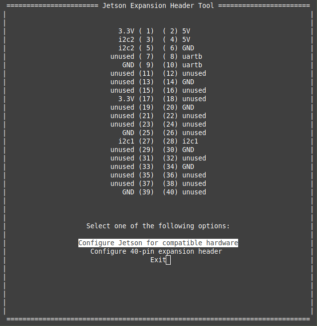
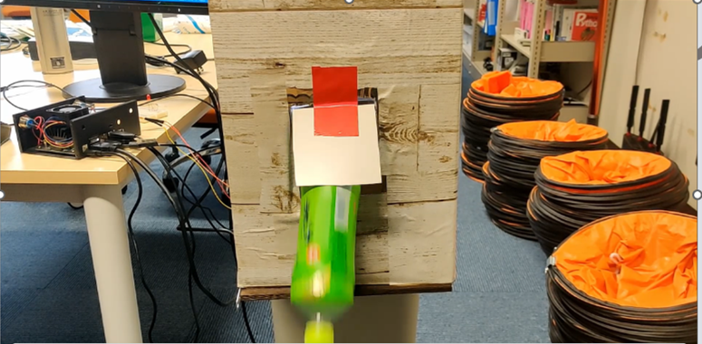
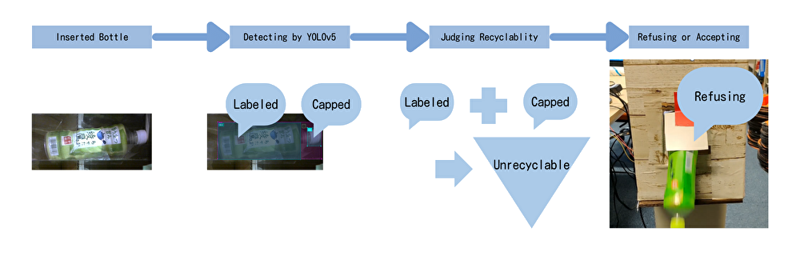

# Intelligent Trash Bin with AI Technology

## Introduction
 We have developed **an intelligent trash bin** equipped with AI technology. This trash bin automatically identifies whether a PET bottle is recyclable or not, and removes non-recyclable items. As depicted in the gif below, it accurately detects labeled or capped PET bottles.<br>


 This machine utilizes deep learning from YOLOv5 to detect PET bottles, labels, and caps. In this project, we created an original dataset consisting of various PET bottles with labels or caps, as well as those without such decorations. Additionally, we programmed the Jetson Nano to control a servo motor, allowing the machine to remove bottles with decorations.

## Table of contents
1. [Background](#background)
1. [Requirements](#requirements)
1. [Set up](#set-up)<!-- 2. [File details](#file-details) -->
1. [Running the application](#running-application)
1. [How it works](#how-it-works)
1. [How the Intelligent Trash Bin Ejects PET Bottles](#how-the-intelligent-trash-bin-ejects-pet-bottles)
1. [Data collection](#data-collection)
1. [Training yolov5](#training-yolov5)
1. [Future direction](#future-directions)

## Background
In waste management facilities, collected PET bottles undergo a sorting process where labels, caps, and contaminated bottles are separated to recycle clean PET bottles. This sorting is often performed manually, which is labor-intensive. By utilizing this smart trash bin, the workload at these facilities can be significantly reduced.

## Requirements
* Hardware
    * Jetson nano × 1
    * Web camera × 1
    * [FLASH HOBBY 45KG Coreless servo motor 8.4V](https://www.amazon.co.jp/dp/B09W4SZNCG/ref=sspa_dk_detail_2?pd_rd_i=B09W4SZNCG&pd_rd_w=JRDh4&content-id=amzn1.sym.f293be60-50b7-49bc-95e8-931faf86ed1e&pf_rd_p=f293be60-50b7-49bc-95e8-931faf86ed1e&pf_rd_r=1JKFW3EMHH3JNZ7M665W&pd_rd_wg=hcBMZ&pd_rd_r=7afb22f4-2fd2-4c27-ace7-4ecac3632113&s=hobby&sp_csd=d2lkZ2V0TmFtZT1zcF9kZXRhaWw&th=1) × 1
    * [リサイクル トラッシュ ペットボトル 40リットル (trash box for plastic bottle: 40L)](https://www.amazon.co.jp/dp/B015DI2AB0?ref_=cm_sw_r_apin_dp_6FSJC40KD1N69Q2FXNX0&language=ja-JP&th=1) × 1
    * SD card(128?64?) × 1
    * Strate plate strap(長さ) × 1
    * (板に吸盤がついててカメラ固定するのに使ったやつ)
    * Mini light × 1
    * Other component:&nbsp; Wood plate,&nbsp; Plastic sheet,&nbsp; Screw,&nbsp; Wood screws,&nbsp; Cardboard,&nbsp; Jumpe wires (male to female)  
    <!-- Wood plate, Plastic sheet × 2?, Screw × ?, Cardboard, Jumper wires  male to female × 12? -->
* Hand tools and fabrication machines
    * Electric screwdriver
    * Saw
* Software *(バージョンのチェックを実機でする)*
    * Python==3.6.8
	* Ubuntu20.04
    * torch
	* cuda
    * Yolov5
    * RPi.GPIO

## Set up
### Software
* First, you must **install Ubuntu 20.04 OS image** for Jetson Nano at URL:
[Jetson Nano with Ubuntu 20.04 OS image](https://github.com/Qengineering/Jetson-Nano-Ubuntu-20-image)

    1. Get a 32 GB (minimal) SD card to hold the image.
    2. Download the image JetsonNanoUb20_3b.img.xz (8.7 GByte!) from our [Sync](https://ln5.sync.com/dl/403a73c60/bqppm39m-mh4qippt-u5mhyyfi-nnma8c4t).
    3. Flash the image on the SD card with the [Imager](https://www.raspberrypi.org/software/) or [balenaEtcher](https://www.balena.io/etcher/). 
    4. According to [issue #17](https://github.com/Qengineering/Jetson-Nano-image/issues/17#) only flash the xz directly, not an unzipped img image.
    5. Insert the SD card in your Jetson Nano and enjoy.
    6. Password: jetson


*swapもしてた*

* Next, you must **set up PWM control pin** in Jetson nano to operate a servo motor. On terminal, input next commands.<br>
References:<br>
[SPI on Jetson – Using Jetson-IO](https://jetsonhacks.com/2020/05/04/spi-on-jetson-using-jetson-io/)<br>
[JetPack 4.3 (r32.3.1) で追加された Jetson-IO tool を使用して Pinmux テーブルを設定してみた。](https://qiita.com/kitazaki/items/a445994f1f46a1b15f78)<br>
 
```
$ sudo /opt/nvidia/jetson-io/jetson-io.py
```

* Next, we can see the screen below.<br>
<div style="text-align: center;">

</div>

* Select Configure 40-pin expansion header<br>
<div style="text-align: center;">

</div>

* Select pwm0, pwm2. (push Shift button)<br>
<div style="text-align: center;">

</div>

* Last, select Save and reboot reconfigure pins<br>
You can check that setting up successes with the command `$ ls -l /boot/*.dtb` and weather new .dtb file is created or not.


If you can’t open jetson-io.py, you should try some fix ways. Especially, we fixed this trouble with the below commands.<br>

Reference:[Jetson Nano の GPIO にサーボモータをつないで制御してみる](https://wisteriahill.sakura.ne.jp/CMS/WordPress/2020/12/07/jetson-nano-gpio-servo-motor/)
```
cd /boot
sudo mkdir dtb
sudo cp *.dtb* dtb/
```
Then you can try again first command.<br>
* Last you **[clone our GitHub](https://github.com/hayato-hayashi/experiment-3)**
```
$ git clone https://github.com/hayato-hayashi/experiment-3.git
$ pip install -r requirements.txt
```

### Hardware
**Cardboard Selection**

Our project involves covering the trash bin lid with a cardboard box. This cardboard box has the following features:

1. **Prevention of External Conditions**:
    - It prevents external conditions such as weather and time of day from affecting the accuracy of the PET bottle image recognition.
2. **Size Adjustment**:
    - The cardboard box completely covers the lid. The length extends " " cm beyond the lid, and the height from the bottom of the trash bin is " " cm.
    - The length ensures space for placing the Jetson Nano, while the height is necessary to keep the discarded PET bottles within the camera's field of view.

**Modifications to the Trash Bin Lid**

We have made the following improvements to the trash bin lid:

1. **Board Installation**:
    - Some boards are installed on the lid to accommodate the Jetson Nano and motor.<br>
    <!--  -->
    - The board is secured to the lid using screws and further stabilized with a Steel Restraint Strap to the sides of the lid.
2. **Lid Improvement**:
    - Screws securing the board and lid penetrate part of the base of the trash bin, making the lid inseparable in its original design.
    - We created a vertical groove at the bottom of the trash bin, as shown in the photo, allowing the lid and base to be separated and facilitating smooth removal of the contents.<br>
    

**Camera Installation**

1. **Cylinder Creation**:
    - Create a cylinder from a plastic sheet large enough to fit a PET bottle.
    
2. **Making a Hole**:
    - Cut a square hole in the front of the cardboard and install the cylinder.
    - The cylinder is installed at an angle of " " degrees.
3. **Camera Positioning**:
    - Adjust the camera position so that the entire cylinder fits within the camera's field of view.
    - Install a baffle outside the intake to prevent light from entering.
    

**Installation of Various Components**

1. **Installation of Motor and Light**:
    - Secure the motor and light to the cardboard and connect them to the Jetson Nano.
    
    - Adjust the motor's angle of movement, the length of the rod, and the dimensions of the cylinder to ensure proper holding, ejection, and acceptance of the PET bottles.
2. **Power Cord Installation**:
    - Once the Jetson Nano is installed, drill a hole at the bottom of the trash bin to pass through the power cord.
<!-- 
## File details
```
experiment-3
├── CITATION.cff
├── CONTRIBUTING.md
├── LICENSE
├── README.md
├── README.zh-CN.md
├── benchmarks.py
├── camera.py       : Run Intelligent Trash Bin
├── createModel.py
├── detect.py
├── export.py
├── hubconf.py
├── jetsoncam.py
├── label_Inflated_water.py : Infrate the images for machine learning
├── models
├── move_in.py      : Put plastic bottle into this trash bin
├── move_out.py     : Eject plastic bottle out of this trash bin
├── move_static.py  : Stay holding plastic bottle with holding area 
├── picture.py      : Obtaining images from the camera
├── recode.py       : Save the video
├── requirements.txt
├── setup.cfg
├── train.py
├── tutorial.ipynb
├── utils
└── val.py
``` -->

## Running application
After setting up about software and hardware preparation, Input below command and wait a several minutes.
```
$ python3 camera.py
```

After this, some logs output at terminal and be written ~~“start ”~~準備が完了したログをターミナルに表示させたい。
ターミナルの画像を貼り付けたい. Then you can use our intelligent trash box. Try to insert some plastic bottles. Please note that you shouldn’t insert a new bottle while this trash box is processing a bottle you entered. If all goes well, you should see the plastic bottle putting in the box or putting out ~~from the box~~画像を張り付けておいたが、gifのほうがいいかもしれない. 



## How it Works

This application leverages YOLOv5 on the Jetson Nano 2GB, optimizing for rapid object detection within the constraints of limited memory. The primary focus is on processing video feed from a camera to detect three key objects: plastic bottles, their labels, and caps. Based on the detection of these items, the system determines whether a plastic bottle is recyclable. If deemed recyclable, the bottle is accepted by the trash bin; otherwise, a motor mechanism ejects it from the bin.<br>

The following figure illustrates a scheme for the method:<br>
<div style="text-align: center;">

</div>

Detailed Process:
1. **Initialization**: The Jetson Nano and application are started, ready to process incoming video feed.
2. **Bottle Detection**: As a plastic bottle is introduced into the trash bin's entry point, the application, powered by YOLOv5 on the Jetson Nano, detects the bottle along with its label and cap. 
3. **Recyclability Assessment**: The application evaluates whether the bottle can be recycled based on the presence of a label and cap.
    * If the bottle lacks a label and cap, it is deemed recyclable and accepted by the trash bin.
    * If a label or cap is detected, the system rejects the bottle, activating a motor to eject it from the bin.
4. **Motor Mechanism**: A servo motor manipulates a panel to manage the bottle's fate:
    * The panel swings back to accept recyclable bottles.
    * It pushes forward to eject non-recyclable bottles outside the bin.

This smart recycling system not only simplifies waste management but also promotes environmental sustainability by ensuring proper segregation of recyclable materials.

## How the Intelligent Trash Bin Ejects PET Bottles
One of the key challenges in designing an automated system for waste management is ensuring that non-recyclable items can be efficiently separated and ejected from the bin. In our Intelligent Trash Bin project, we've implemented a couple of ingenious solutions to address this challenge effectively.

### Innovative Ejection Mechanism
Our design incorporates a specialized ejection mechanism that leverages a combination of mechanical ingenuity and precise control. Here are the main innovations we've made:

* **Adjustable Plastic Cylinder**: The bin's intake is equipped with a plastic cylinder that acts as a conduit for PET bottles. We meticulously adjusted the lengths of the upper and lower surfaces of this cylinder to optimize the ejection process. This adjustment ensures that a wooden rod, swung by a servo motor, can effectively push up and eject the PET bottle from the cylinder.

* **Strategic Intake Placement**: The intake is created by cutting a portion of the cardboard that encases the trash bin and inserting the adjusted plastic cylinder. A crucial innovation here is the placement of the intake with tape on the upper side rather than the lower side of the cut-out in the cardboard. This placement makes it easier for the intake to lift during the ejection process, facilitating smoother discharge of the PET bottles.

The below are gifs discharging plastic bottle (left) and placing plastic bottle inside (right). 


These design choices are central to the Intelligent Trash Bin's ability to differentiate and eject non-recyclable PET bottles. By fine-tuning the physical components and their interactions, we've achieved a system that not only automates waste segregation but does so with high efficiency and reliability.

## Data Collection
To accurately recognize plastic bottles, caps, and labels, we undertook a comprehensive data collection process. Our goal was to gather images that reflect the variety of ways a plastic bottle can appear when introduced into the trash bin. We created **a holding area** at the trash bin's entrance, made from transparent plastic sheets, to ensure bottles remained in place during image capture. The camera was positioned to capture the entire holding area within its field of view. *

Collection Procedure:
1. Preparing the Bottles: We started with a collection of approximately 150 plastic bottles in various conditions. Instead of preparing separate groups of bottles with and without labels and caps, we utilized the same set of bottles for multiple stages of data collection. Initially, we photographed each bottle in its current state, capturing images of bottles with labels and caps intact. Subsequently, we removed the caps from these bottles and took additional photographs. Finally, we removed both the labels and caps, capturing images of the bottles in a completely unadorned state. This method allowed us to create a diverse dataset from a fixed number of bottles, ensuring a wide range of conditions were represented in our training data.

2. Capturing Images: The photographic process was carefully designed to avoid detection inaccuracies due to the orientation of bottle insertion. For each stage of bottle preparation (with labels and caps, with caps removed, and with both removed), we captured images in two orientations: cap-first and cap-last. This approach ensured our model would learn to recognize bottles irrespective of how they were introduced into the bin. Each bottle's various states were documented from multiple angles to further enhance the model's accuracy and robustness in real-world scenarios.

3. Annotation Process: Each image was annotated to identify the entire bottle, label, and cap positions using the [VoTT](https://github.com/Microsoft/VoTT/releases). The annotations were initially saved in the Pascal VOC format (XML output), which were later converted to the YOLOv5 format through web tools ([Convert Pascal VOC Format to YOLO Format](https://github.com/rihib/p2y-converter)) for compatibility. <br>


4. Image Augmentation: To enhance our dataset, we manipulated the brightness of images for augmentation, effectively increasing our dataset without needing to physically collect more samples. This process resulted in approximately 1000 annotated images ready for training.

5. Usage: The annotated data will be utilized for training the YOLOv5 model, enabling our application to correctly detect plastic bottles, labels, and caps. This is crucial for the automatic segregation of recyclable materials, improving recycling efficiency.

## Training YOLOv5
*Google Colaboratoryで使用した具体的なコードやコマンドラインの例がない。*

We conducted transfer learning using **YOLOv5** on our dataset. Our annotations were initially in the Pascal VOC XML format, which we converted to the YOLO format for training purposes. Unlike the typical approach using Docker environments for machine learning tasks, we utilized **Google Colaboratory** for our training process. This platform allowed us to leverage its powerful GPUs for training, significantly speeding up the process. Here's an overview of the steps we followed:

1. Annotation Conversion: Converted our dataset annotations from Pascal VOC's XML format to YOLO format to make them compatible with YOLOv5.
2. Training in Google Colaboratory:
    * Uploaded our YOLO-formatted dataset to Google Colab.
    * Ran our transfer learning script on YOLOv5 using the Colab notebook, specifying our dataset path.

This approach enabled efficient use of resources and streamlined our model training phase.

## Future directions
The current model has been trained using approximately a hundred PET bottles collected from various locations within Gifu University's campus, resulting in a prediction capability limited to the **preferences of Gifu University students**. In the future, I plan to enhance the prediction capability by incorporating data on plastic bottle preferences from individuals across different age groups, including the elderly and children.

